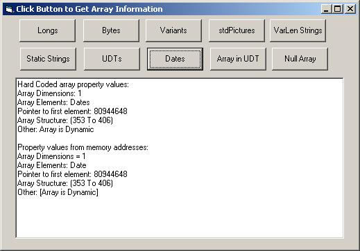



## FYI: SafeArrays \- Understanding Them

### Description

A little project to help explain how to read SafeArray structures just from the pointer. The project shows how you can determine if the array contains longs, dates, variants, etc, the number of dimensions, and more. Additionally, the code does not use VarPtrArray API to get the SafeArray address - neat trick. This is not groundbreaking code, but would be of interest to those that like the behind the scenes stuff. Included are "how to's" on creating your own and using them.
 
### More Info
 

             |
---                |---
**Submitted On**   |2007-03-04 00:27:12
**By**             |[LaVolpe](https://github.com/Planet-Source-Code/PSCIndex/blob/master/ByAuthor/lavolpe.md)
**Level**          |Intermediate
**User Rating**    |5.0 (45 globes from 9 users)
**Compatibility**  |VB 5\.0, VB 6\.0
**Category**       |[Data Structures](https://github.com/Planet-Source-Code/PSCIndex/blob/master/ByCategory/data-structures__1-33.md)
**World**          |[Visual Basic](https://github.com/Planet-Source-Code/PSCIndex/blob/master/ByWorld/visual-basic.md)
**Archive File**   |[FYI\_\_SafeA205154342007\.zip](https://github.com/Planet-Source-Code/lavolpe-fyi-safearrays-understanding-them__1-68004/archive/master.zip)

